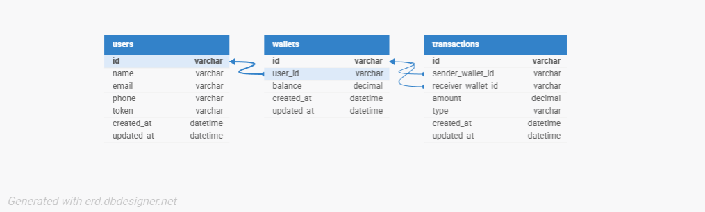

# Demo Credit Wallet Service

A wallet service API built for the Lendsqr Backend Engineering Assessment. This service allows users to create accounts, fund wallets, transfer funds, and withdraw money.

---

## Table of Contents

- [Project Overview](#project-overview)
- [Tech Stack](#tech-stack)
- [Architecture & Design Decisions](#architecture--design-decisions)
- [ER Diagram](#er-diagram)
- [Project Structure](#project-structure)
- [Getting Started](#getting-started)
- [Environment Variables](#environment-variables)
- [API Documentation](#api-documentation)
- [Running Tests](#running-tests)
- [Deployment](#deployment)

---

## Project Overview

Demo Credit is a mobile lending app that requires wallet functionality. Borrowers need a wallet to:
- Receive loans that have been granted
- Send money for repayments

This MVP wallet service provides the following features:
- A user can create an account
- A user can fund their wallet
- A user can transfer funds to another user
- A user can withdraw funds from their wallet
- Users on the Lendsqr Adjutor Karma blacklist cannot be onboarded

---

## Tech Stack

| Technology | Reason |
|---|---|
| **NodeJS (LTS)** | Required by assessment. Fast, non-blocking I/O ideal for financial APIs |
| **TypeScript** | Type safety reduces runtime errors, improves code quality and maintainability |
| **Express v4** | Stable, widely used framework with strong TypeScript support |
| **KnexJS ORM** | Required by assessment. Provides query builder with transaction support |
| **MySQL** | Required by assessment. Reliable relational database for financial data |
| **Jest + Supertest** | Industry standard for Node.js unit and integration testing |
| **tsx** | Fast TypeScript execution without compilation step during development |
| **dotenv** | Secure environment variable management |
| **uuid** | Generates unique IDs for users, wallets, and transactions |

---

## Architecture & Design Decisions

### Folder Structure
The project follows a layered architecture separating concerns into controllers, services, models, routes and middlewares. This makes the codebase easy to navigate, test and extend.

### Faux Authentication
Since a full authentication system was out of scope, a UUID token is generated on user creation and stored in the database. Every protected request must include this token as a Bearer token in the Authorization header. The middleware looks up the token in the database and attaches the user to the request object.

### Karma Blacklist Check
Before onboarding any user, the system calls the Lendsqr Adjutor Karma API at `https://adjutor.lendsqr.com/v2/verification/karma/{identity}` to verify the user is not blacklisted. If the API returns a match, the user registration is rejected with a 403 Forbidden response and the account is not created. The Adjutor API is fully integrated and live.

### Transaction Scoping
All wallet operations (fund, transfer, withdraw) are wrapped in Knex database transactions. This ensures that if any part of the operation fails, the entire operation is rolled back — preventing partial updates or inconsistent balances.

### Database Design
UUIDs are used as primary keys instead of auto-increment integers for better security and scalability. Decimal(15,2) is used for all monetary values to avoid floating point precision issues.

---

## ER Diagram



### Tables

**users**
| Column | Type | Description |
|---|---|---|
| id | UUID | Primary Key |
| name | VARCHAR | Full name |
| email | VARCHAR | Unique email |
| phone | VARCHAR | Phone number |
| token | VARCHAR | Faux auth token |
| created_at | TIMESTAMP | |
| updated_at | TIMESTAMP | |

**wallets**
| Column | Type | Description |
|---|---|---|
| id | UUID | Primary Key |
| user_id | UUID | Foreign Key → users.id |
| balance | DECIMAL(15,2) | Current balance |
| created_at | TIMESTAMP | |
| updated_at | TIMESTAMP | |

**transactions**
| Column | Type | Description |
|---|---|---|
| id | UUID | Primary Key |
| sender_wallet_id | UUID | Foreign Key → wallets.id (nullable) |
| receiver_wallet_id | UUID | Foreign Key → wallets.id |
| amount | DECIMAL(15,2) | Transaction amount |
| type | ENUM | fund, transfer, withdraw |
| created_at | TIMESTAMP | |
| updated_at | TIMESTAMP | |

---

## Project Structure

```
lendsqr-wallet-service/
├── src/
│   ├── config/
│   │   └── db.ts              # Knex database connection
│   ├── controllers/
│   │   ├── user.controller.ts # User registration logic
│   │   └── wallet.controller.ts # Wallet operations logic
│   ├── database/
│   │   ├── migrations/        # Knex migration files
│   │   └── migrate.ts         # Migration runner
│   ├── middlewares/
│   │   └── auth.middleware.ts # Token authentication
│   ├── models/
│   │   ├── user.model.ts      # User database queries
│   │   ├── wallet.model.ts    # Wallet database queries
│   │   └── transaction.model.ts # Transaction database queries
│   ├── routes/
│   │   ├── user.routes.ts     # User routes
│   │   └── wallet.routes.ts   # Wallet routes
│   ├── services/
│   │   └── karma.service.ts   # Karma blacklist check
│   ├── tests/
│   │   ├── user.test.ts       # User endpoint tests
│   │   └── wallet.test.ts     # Wallet endpoint tests
│   ├── types/
│   │   └── index.ts           # TypeScript interfaces
│   ├── app.ts                 # Express app setup
│   └── server.ts              # Server entry point
├── .env.example               # Environment variables template
├── knexfile.ts                # Knex configuration
├── package.json
├── tsconfig.json
└── README.md
```

---

## Getting Started

### Prerequisites
- Node.js LTS
- MySQL 8.0+

### Installation

**1 — Clone the repository:**
```bash
git clone https://github.com/dygoodchild224/lendsqr-be-test.git
cd lendsqr-be-test
```

**2 — Install dependencies:**
```bash
npm install
```

**3 — Create `.env` file:**
```bash
cp .env.example .env
```

**4 — Update `.env` with your values:**
```env
PORT=3000
DB_HOST=127.0.0.1
DB_PORT=3306
DB_USER=root
DB_PASSWORD=yourpassword
DB_NAME=lendsqr_wallet
ADJUTOR_API_KEY=your_adjutor_api_key
```

**5 — Create the database in MySQL:**
```sql
CREATE DATABASE lendsqr_wallet;
```

**6 — Run migrations:**
```bash
npm run migrate:latest
```

**7 — Start the development server:**
```bash
npm run dev
```

---

## Environment Variables

| Variable | Description |
|---|---|
| PORT | Server port (default: 3000) |
| DB_HOST | MySQL host |
| DB_PORT | MySQL port |
| DB_USER | MySQL username |
| DB_PASSWORD | MySQL password |
| DB_NAME | MySQL database name |
| ADJUTOR_API_KEY | Lendsqr Adjutor API key |

---

## API Documentation

### Base URL
```
https://collins-henry-lendsqr-be-test.up.railway.app/api/v1
```

### Authentication
All wallet endpoints require a Bearer token in the Authorization header:
```
Authorization: Bearer <token>
```
The token is returned when a user is created.

---

### User Endpoints

#### Create User
```
POST /api/v1/users
```

**Request Body:**
```json
{
  "name": "John Doe",
  "email": "john@example.com",
  "phone": "08012345678"
}
```

**Success Response (201):**
```json
{
  "status": "success",
  "message": "User created successfully",
  "data": {
    "user": {
      "id": "uuid",
      "name": "John Doe",
      "email": "john@example.com",
      "phone": "08012345678"
    },
    "wallet": {
      "id": "uuid",
      "balance": 0
    },
    "token": "uuid"
  }
}
```

**Error Responses:**
- `400` — Missing required fields
- `403` — User is blacklisted
- `409` — Email already exists

---

### Wallet Endpoints

All wallet endpoints require Authorization header.

#### Get Balance
```
GET /api/v1/wallet/balance
```

**Success Response (200):**
```json
{
  "status": "success",
  "data": {
    "balance": 5000
  }
}
```

---

#### Fund Wallet
```
POST /api/v1/wallet/fund
```

**Request Body:**
```json
{
  "amount": 5000
}
```

**Success Response (200):**
```json
{
  "status": "success",
  "message": "Wallet funded successfully",
  "data": {
    "new_balance": 5000
  }
}
```

**Error Responses:**
- `400` — Invalid or missing amount
- `401` — Invalid or missing token

---

#### Transfer Funds
```
POST /api/v1/wallet/transfer
```

**Request Body:**
```json
{
  "amount": 1000,
  "recipient_email": "jane@example.com"
}
```

**Success Response (200):**
```json
{
  "status": "success",
  "message": "Transfer successful",
  "data": {
    "new_balance": 4000
  }
}
```

**Error Responses:**
- `400` — Invalid amount, insufficient balance, or self-transfer
- `401` — Invalid or missing token
- `404` — Recipient not found

---

#### Withdraw Funds
```
POST /api/v1/wallet/withdraw
```

**Request Body:**
```json
{
  "amount": 500
}
```

**Success Response (200):**
```json
{
  "status": "success",
  "message": "Withdrawal successful",
  "data": {
    "new_balance": 3500
  }
}
```

**Error Responses:**
- `400` — Invalid amount or insufficient balance
- `401` — Invalid or missing token

---

## Running Tests

```bash
# Run all tests
npm test

# Run with coverage report
npm run test:coverage
```

---

## Deployment

The API is deployed on Railway at:

```
https://collins-henry-lendsqr-be-test.up.railway.app
```

### Live API Base URL

```
https://collins-henry-lendsqr-be-test.up.railway.app/api/v1
```

### GitHub Repository

```
https://github.com/dygoodchild224/lendsqr-be-test
```